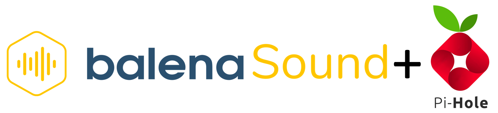

**Project enabling you to add multi-room audio streaming via Bluetooth, Airplay or Spotify Connect to any old speakers or Hi-Fi as well as network-wide ad blocking using just a Raspberry Pi.**

# Highlights

- **Bluetooth, Airplay, Spotify Connect and UPnP**: Stream audio from your favourite music services or directly from your smartphone/computer using bluetooth or UPnP.
- **Multi-room synchronous playing**: Play perfectly synchronized audio on multiple devices all over your place.
- **Extended DAC support**: Upgrade your audio quality with one of our supported DACs
- **Ad blocking on all devices**: This includes devices that normally can't get ad-blockers, such as smart TVs

# Setup and configuration

## Hardware required

* Raspberry Pi 3A+/3B/3B+/4B
* microSD card
* Power supply
* Router (No need for a dedicated router, it can be the same one as your personal router)
* Speaker System
* Appropriate cabling to connect your Raspberry Pi to the speakers

## Software required

* A download of this project (of course)
* Software to flash an SD card ([balenaEtcher](https://balena.io/etcher))
* A free [balenaCloud](https://balena.io/cloud) account
* (Optional) The [balena CLI tools](https://github.com/balena-io/balena-cli/blob/master/INSTALL.md)

## Setup and Use Guide

To run this project is as simple as deploying it to a balenaCloud application; no additional configuration is required.

### Setup the Raspberry Pi

* Sign up for or login to the [balenaCloud dashboard](https://dashboard.balena-cloud.com)
* Create an application, selecting the correct device type for your Raspberry Pi
* Add a device to the application, enabling you to download the OS
* Flash the downloaded OS to your SD card with [balenaEtcher](https://balena.io/etcher)
* Power up the Pi and check it's online in the dashboard

### One Click Deployment

You can deploy this server with one click with the button below. Or, you can follow the manual deployment instructions in the next section.

### Manually Deploy this application :airplane:

* Install the [balena CLI tools](https://github.com/balena-io/balena-cli/blob/master/INSTALL.md)
* Login with `balena login`
* Download this project and from the project directory run `balena push <appName>` where `<appName>` is the name you gave your balenaCloud application in the first step.

### Set up your router/clients

The next thing we have to handle is changing your network configuration so that all DNS requests go via your new Pi-hole device rather than through your router or ISP.

tl;dr: We need to set the DNS server settings on your router or client device to point to the local IP address of Pi-hole.

The main thing we need is the IP address of your new Pi-hole device. If you set this to a fixed/static IP earlier in the guide you’ll know what this is already. If not, you can find out by visiting the application or device list page in the balenaCloud dashboard.

For initial testing purposes, you might want to change just one device on the network, such as your computer or laptop, to try it out. After you’re happy with how things are running, you can deploy network-wide by changing the settings on your router or DHCP server to point all devices/clients on your network to Pi-hole automatically. Dynamic Host Configuration Protocol (DHCP) is a method used on a lot of networks to automatically set up computers, smartphones and other devices with the correct network settings as soon as they connect. By default, your router will issue DNS settings pointing either to the router itself or to your ISP; we’re going to change that so that your DNS settings will point to Pi-hole in order for it to filter the requests before they reach your computer.

On your router, look for anything relating to DHCP and the associated options. You’re looking for a screen similar to that below. If you’re not sure what you’re doing, make a note or take a screenshot before changing anything so you can revert the settings if you make a mistake.

#### Windows

In Windows, you can access the DNS settings for a connection by first locating the connection status, then going to properties, and then highlighting Internet Protocol Version 4 (TCP/IPv4) and clicking properties again, as in the screenshot below. Different versions of Window may look slightly different but the principle is always the same.

#### macOS

Within macOS, find System Preferences, and then open the Network pane. The left hand column will show all of your network interfaces; select the one that you’re using and is connected, and then click on the Advanced button, which will bring up a panel similar to that below where you can choose the DNS tab and enter the IP address of Pi-hole on your network manually.

#### iOS

When using iOS, go to Settings > Wi-Fi and tap on the i to the right of the network you’re connected to. This opens a new page where you can tap on Configure DNS to reach the screen below:

#### Android

When using an Android device, the method used to change the DNS settings varies depending on the version. OpenDNS has [a guide](https://support.opendns.com/hc/en-us/articles/228009007-Android-Configuration-instructions-for-OpenDNS) to doing this, just remember to use your own Pi-hole IP address rather than the OpenDNS ones.

#### Other

Pi-hole also have an [extensive forum thread](https://discourse.pi-hole.net/t/how-do-i-configure-my-devices-to-use-pi-hole-as-their-dns-server/245) telling you how to set this up for various devices and operating systems.

### Pi-hole Dashboard

You can access the web interface if you’re on the same network by visiting the local IP address of your new device in a browser. If you don’t know the IP of your device, the easiest way to find it is on the [balenaCloud dashboard](https://dashboard.balena-cloud.com/apps).

# Documentation 

Head over to the documentation below for detailed installation and usage instructions, customization options and more!
* [balenaSound Documentation](https://sound.balenalabs.io/docs/)
* [Pi-hole Documentation](https://docs.pi-hole.net/)

# Motivation

There are many commercial solutions out there that provide functionality similar to balenaSound. Most of them though come with a premium price tag and are riddled with privacy concerns. 

balenaSound is an open source project that allows you to build your own DIY audio streaming platform without compromises. Why spend big money on hardware that might be deemed obsolete by the vendor as they see fit? With balenaSound you are in control, bring your old speakers back to life!

Pi-hole is an open source project that conveniently blocks all ads network-wide, with little to none user input required.

# Device Variables

Device Variables apply to all services within the application, and can be applied fleet-wide to apply to multiple devices.
To edit, navigate to dashboard -> your app -> Environment variables.

**Pi-hole**
|Name|Example|Purpose|
|---|---|---|
|`TZ`|`America/Toronto`|To inform services of the timezone in your location, in order to set times and dates within the applications correctly. Find a [list of all timezone values here](https://en.wikipedia.org/wiki/List_of_tz_database_time_zones).|
|`DNSMASQ_LISTENING`|`eth0`|We set this to `eth0` to indicate we want DNSMASQ to listen on the ethernet interface of the Raspberry Pi. If you're connecting to your network with WiFi replace this with `wlan0`|
|`INTERFACE`|`eth0`|As above.|
|`WEBPASSWORD`|`mysecretpassword`|_(optional)_ password for accessing the web-based interface of Pi-hole - you won’t be able to access the admin panel without defining a password here.
|`DNS1`|`127.0.0.1#5053`|_(optional)_ Tell Pi-hole where to forward DNS requests that aren’t blocked. We’re using the [dnscrypt-proxy](https://github.com/DNSCrypt/dnscrypt-proxy) project here but you can specify your own.|
|`DNS2`|`127.0.0.1#5053`|_(optional)_ Secondary DNS server - see above.|
|`ServerIP`|`x.x.x.x`|_(recommended)_ Set to your server's LAN IP, used by web block modes and lighttpd bind address.|

**balenaSound**
|Name|Example|Purpose|
|---|---|---|
|`DEVICE_NAME`|`My balenaSound/pihole combo!`|By default, your device will be named balenaSound xxxx. This name will show within Airplay device lists, for Spotify Connect, and when searching for devices using Bluetooth.|
|`SYSTEM_OUTPUT_VOLUME`|`80`|By default, balenaSound will set the output volume of your Raspberry Pi to 75% on the basis you can then control the volume upto the maximum from the connected bluetooth device. You can edit the default volume through this variable|
|`DISABLE_MULTI_ROOM`|`1`|By default, balenaSound will start in multi-room mode. When running multi-room you can stream audio into a fleet of devices and have it play perfectly synchronized. It does not matter wether you have 2 or 100 devices, you only need them to be part of the same local network.  If you don't want to use multi-room or you only have one device, you can disable it by creating the DISABLE_MULTI_ROOM variable (with any value, for example: 1).  Note: Multi-room requires a network router that supports IP multicast/broadcast (most modern routers do).|
|`BLUETOOTH_PIN_CODE`|`123456`|By default, balenaSound bluetooth will connect using Secure Simple Pairing mode. If you would like to override this and use Legacy Mode with a PIN code you can do it by defining the BLUETOOTH_PIN_CODE environment variable. The PIN code must be numeric and up to six digits (1 - 999999).  Note: Legacy Mode is no longer allowed on iOS devices.|
|`SPOTIFY_LOGIN`|`MyUsernameForSpotify`|Spotify Connect only works with Spotify Premium accounts (due to the use of the librespot library). If you have a Spotify Premium account, you can stream locally without any configuration. If you want to use Spotify Connect over the internet, you'll need to provide your Spotify credentials. To enable Spotify login you can add your username/e-mail and password|
|`SPOTIFY_PASSWORD`|`MyPasswordForSpotify`|See above.|

# Acknowledgements

* <https://github.com/klutchell/balena-pihole>
* <https://github.com/balenalabs/balena-sound>
* <https://github.com/pi-hole/docker-pi-hole/>
* <https://github.com/DNSCrypt/dnscrypt-proxy>
* <https://sound.balenalabs.io/docs/customizations/>
* <https://www.balena.io/blog/deploy-network-wide-ad-blocking-with-pi-hole-and-a-raspberry-pi/>